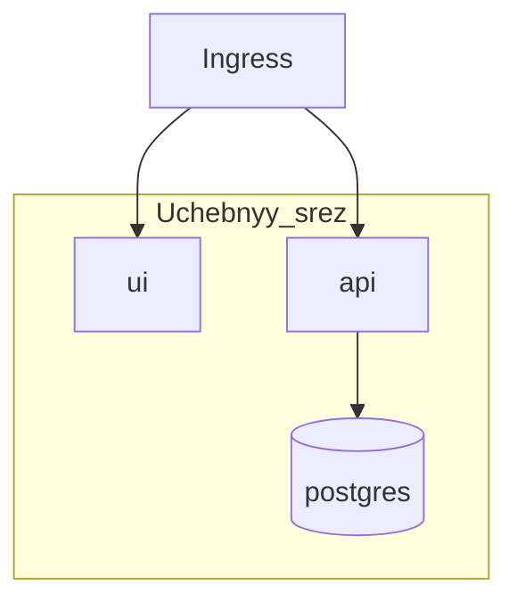

# S01E19 · Склейка: тот же срез на Minikube + что смотреть в kubectl

## Пост

S01E19 · Склейка · срез на Minikube

Финал сезона 1: ваш учебный сервис «Заявки» поднимается в Minikube так же предсказуемо, как в Compose. CopyParse рядом — карта большого стенда, не ДЗ «поднять всё».

Чеклист склейки:

1. Образы UI + API в docker Minikube.
2. Deployment/Service/Ingress/Secret на месте.
3. `/health` зелёный, CRUD заявки через браузер на Ingress.
4. Вы знаете команды: `get`, `logs`, `describe`, `rollout status`.

Зачем это в живом сервисе. Дальше — сезон 2 (Redis, очереди, Jenkins). Сейчас вы доказали, что слои UI/API/БД/деплой собираются без магии.

Граница. Не объявляйте «я знаю Kubernetes», если не можете объяснить, зачем Service, если уже есть Pod IP.

После E19: короткий пост трека B (какую фичу вы убили) — по желанию; продукт CopyParse — отдельный бренд релизов.

## Лаба

60 минут.

1. С нуля: `minikube start` → apply манифестов → проверка UI.
2. Удалите pod API — убедитесь, что сервис восстановился.
3. Снимите `kubectl get all` и один `logs`.
4. В README: «как поднять учебный срез за 15 минут».

В группу: скрин UI через Ingress + `kubectl get all`.

Проверка: одногруппник по вашему README поднимает стенд без голосовых подсказок.

## Ссылки

- CopyParse (регистрация, учебный контур): https://www.copyparse.ru/sign-up?utm_source=tg&utm_campaign=s01e19
- kubectl cheat sheet — https://kubernetes.io/docs/reference/kubectl/quick-reference/
- CopyParse карта стенда — docs/ARCHITECTURE.md
- Установка стенда курса — docs/INSTALLATION.md
- k8s/README.md

## Схема

