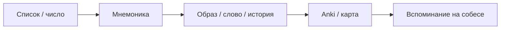

## Введение

На собеседовании часто просят воспроизвести список (ACID, OSI, уровни тестов) или число (порт, RFC). Anki и карта знаний у нас уже есть — они отвечают за **повторение**. Этот выпуск про **кодирование**: как превратить сухой список в образ, слово или историю, чтобы его вообще было что повторять. Дальше открывайте плашку «Мнемотехники» или раздел ниже.

## Раздел: Пять техник первой волны

1. **Акроним** — первые буквы складываются в слово (ACID, SOLID).
2. **Акростих** — буквы дают фразу (Please Do Not Throw Sausage Pizza Away).
3. **Чанкинг** — длинную строку режем на группы (54-32, IP-октеты).
4. **Цепочка / link** — элементы связываем историей в нужном порядке.
5. **Крючки / peg** — номер 1…N уже имеет образ; на него «вешаем» элемент списка.

Дополнительно (без отдельного движка в v1): дворец памяти, major system для цифр, keyword для чужих терминов. Spaced repetition не дублируем — это Anki.

## Раздел: Как пользоваться на 9to18

- В статье Learn добавьте раздел `## Мнемоника` с дриллами.
- Плашка `/game/mnemonics` собирает дриллы из всех опубликованных выпусков.
- На карте знаний лист с `{learn:slug}` показывает дриллы связанной статьи.

## Лаба

**Цель.** Закодировать один список из своей будущей собес-темы.

**Шаги.**
1. Выберите список из 4–7 элементов (свой или ACID/OSI из дриллов ниже).
2. Примените одну технику: акроним *или* цепочку *или* крючки.
3. Через 10 минут без подглядывания восстановите список вслух.
4. Занесите пару «вопрос → ответ» в Anki статьи (если ещё нет).

**В группу:** ваша фраза/акроним и список.

**Готово, если…**
- [ ] Список восстановлен без шпаргалки
- [ ] Понятно, какая техника сработала и почему

## Схема: Кодирование → повторение

## Тест

### Чем мнемоника отличается от Anki?

**Ответ:** мнемоника кодирует материал в образ; Anki планирует повторения

**Пояснение:** без кодирования карточка — просто текст; без SRS образ забывается.

### Какая техника лучше для нумерованного списка из 7 пунктов?

**Ответ:** система крючков (peg) или дворец памяти

**Пояснение:** у каждого номера уже есть «гвоздь», на который вешается элемент.

### Что такое чанкинг?

**Ответ:** разбиение длинной строки на короткие группы

**Пояснение:** рабочая память держит ~4±1 чанка, не произвольную длину.

## Шпаргалка

<h3>Когда какую технику</h3>
<ul>
<li><b>Акроним</b> — фиксированный короткий список с удобными буквами</li>
<li><b>Акростих</b> — буквы не складываются в слово</li>
<li><b>Чанкинг</b> — порты, UUID, команды, номера</li>
<li><b>Цепочка</b> — порядок шагов / pipeline</li>
<li><b>Крючки</b> — нумерованные списки 5–12 пунктов</li>
</ul>
<h3>Правило</h3>
<pre><code>сначала закодировать → потом в Anki
не дублировать карту знаний как «дворец»</code></pre>

## Anki

### Front: Мнемоника vs SRS?

Back: мнемоника = кодирование в образ; SRS/Anki = расписание повторений

### Front: Peg system одним предложением

Back: у каждого числа есть заранее выученный образ-крючок; элемент списка «вешается» на крючок

### Front: Пример акростиха для OSI

Back: Please Do Not Throw Sausage Pizza Away (Physical…Application)

## Мнемоника

### acronym: ACID
**Задание:** Запомните свойства транзакции.
**Элементы:**
- Atomicity
- Consistency
- Isolation
- Durability
**Подсказка:** слово из первых букв.
**Ответ:** ACID

### acrostic: OSI
**Задание:** Запомните 7 слоёв OSI снизу вверх.
**Элементы:**
- Physical
- Data Link
- Network
- Transport
- Session
- Presentation
- Application
**Подсказка:** Please Do Not Throw Sausage Pizza Away
**Ответ:** Please Do Not Throw Sausage Pizza Away

### chunking: Порт PostgreSQL
**Задание:** Запомните порт, разбив на группы.
**Элементы:**
- 5432
**Подсказка:** 54 · 32
**Ответ:** 54-32

### link: Уровни тестов
**Задание:** Свяжите уровни историей.
**Элементы:**
- unit
- integration
- system
- acceptance
**Подсказка:** от модуля к приёмке.
**Ответ:** unit → integration → system → acceptance

### peg: Слои сервиса
**Задание:** Повесьте слои на крючки 1–4.
**Элементы:**
- UI
- API
- БД
- Деплой
**Подсказка:** 1=кол, 2=лебедь, 3=трезубец, 4=стул.
**Ответ:** 1 UI · 2 API · 3 БД · 4 Деплой

## Итоги

- Кодирование и повторение — разные навыки; на 9to18 для них разные инструменты
- Пять техник покрывают списки, числа и порядок шагов на большинстве собесов
- Дриллы живут в статьях Learn и поднимаются на плашку и карту

## Ссылки

- Тренажёр | /game/mnemonics
- Карта обучения | /game/learning-map
- Learn | /game/learn
